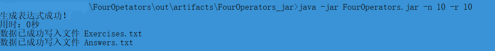

## PSP表格


| ***\*PSP2.1\****                        | ***\*Personal Software Process Stages\**** | ***\*预估耗时（分钟）\**** | ***\*实际耗时（分钟）\**** |
| --------------------------------------- | ------------------------------------------ | -------------------------- | -------------------------- |
| Planning                                | 计划                                       | 20                         | 40                        |
| · Estimate                              | · 估计这个任务需要多少时间                  |10                        | 10        |
| Development                             | 开发                                       | 300                      | 600                       |
| · Analysis                              | · 需求分析 (包括学习新技术)                | 200                     | 300                |
| · Design Spec                           | · 生成设计文档                             | 20                        | 60                         |
| · Design Review                         | · 设计复审                                 | 30                       | 10                          |
| · Coding Standard                       | · 代码规范 (为目前的开发制定合适的规范)    | 30                         | 10                          |
| · Design                                | · 具体设计                                 | 200                     | 300                       |
| · Coding                                | · 具体编码                                 | 300                     | 400                      |
| · Code Review                           | · 代码复审                                 | 30                         | 10                          |
| · Test                                  | · 测试（自我测试，修改代码，提交修改）     | 60                         | 240 |
| Reporting                               | 报告                                       | 60                         | 100 |
| · Test Repor                            | · 测试报告                                 | 30                         | 40 |
| · Size Measurement                      | · 计算工作量                               | 10                         | 10 |
| · Postmortem & Process Improvement Plan | · 事后总结, 并提出过程改进计划             | 20                         | 10 |
|                                         | · 合计                                     | 1320                      | 2410 |

一


## 需求分析

粗略看下来，先站在宏观角度审视题目，我需要构造一个四则运算的表达式，存入Exercises.txt，然后计算出每道题的答案，存入Answers.txt文件中。前面完成了创造和计算功能，后面还要实现检验对错功能。按照生成的Exercis.txt计算结果，并且写入MyAnswers.txt，判断MyAnswers.txt的正确的题目数目，并写入Grade.txt。

1. 根据上文，此处我们要`构造四则运算的表达式`

   1. 先拿出个普通四则运算看看：1+2+3=。可以看到我们目前有什么，数字和符号。那么我们何不将一个多项式拆分为两个part——Number和Operator，每个part都有一个数组存放他们的值。

   2. 注意，我们始终要明确自己的大方向是创造给人看的东西，也就是我们要在这里创建一个字符串以便写入文件。何不设置一个数组呢，每个element存放一个字符，将数组的元素全部输入到文件去，不就打印出“1+2+3=”了吗

   3. 现在有了container和element，就要想想以下几个问题：(1)怎么往容器里面放元素？即如何生成多项式  (2)如何计算并得出结果？(3)是否可以优化？

      1. 第一个问题貌似有点复杂，脑袋a cloud of浆糊，先想想我会遇到什么情况：生成什么数字？生成什么运算符？生成多少个运算符？出现括号咋办？如何保证表达式不重复 ？如何保证不出现负数？即若出现e1− e2的子表达式，那么e1≥ e2 

         1. 创建一个Number类，其中包含一个double类型的属性为value，value自然是由我给出的上限来限定，注意当我给的自然数为10时，随机产生的实数∈[0,10)即可，但为了考虑到真分数这好哥们，我的新思路是：定义一个value存放真正的值，定义一个form存放它的形式，而为了便于计算，所有的数即便是自然数也表示为"10/1"，而且混合数也表示为"10/7"，具体原因见下文。

         2. 创建一个Operator类，其中一个int类型的属性value，其中1:2:3:4 = +:-:×:÷；一个属性是long类型的id，用以区别形式一样但不同的符号；还有一个boolean类型的isNeedBracket属性，为true表明需要加括号

         3. 生成的运算符数量∈[1,3]

         4. 出现括号就很复杂了，虽然但是，经过一通乱搞我还是想到了个不错的解法：

            - 定义一个类MathExpression类，这个类有两个属性value和formOfFormula，Number类型的value记录当前表达式的值，而String类型的formOfFormula记录表达式的形式，如"1+2×3"、"(1+1)"、"1×(2+2'1/2)"或"1×(1+1)"等等

              定义两个优先级数组，一个存放×÷，一个存放+-，数组的元素按照从头到尾的顺序参与计算，即元素的下标代表优先级

            - 先将生成的公式的+-和×÷按照从左至右的顺序分别依次放入各自的数组中

              将两个数组的全部元素按照随机的顺序排列到一个新数组中

              此时这个新数组则代表全部运算符的优先级，从头到尾依次参与计算

              > - 计算的过程分为两种情况：
              >   - 如果参与运算的是+-符号，那么它就需要看存放×÷的数组是否还有元素。如果有，那就代表它要优先计算，因为×÷的优先级肯定比+-高，如果想让它优先计算，那么就需要加括号(让其对应属性为true)，**但是必须考虑到一种特殊情况**，此时有一个字符串"1+2-1×3"，按照"+ - ×"的顺序，按照上述步骤会得到"((1+2)-1)×3"，实际上应该是"(1+2-1)×3"。此时就需要加上这样一步，判断这个"+"或"-"如果是"+-"数组的首元素，并且在它后面紧挨着的符号也是"+"或"-"的话，则不需要让其加上括号；如果没有，那就看它是不是+-数组的首位元素(id比较)，如果不是，说明它也需要`"逆天改命"`，提高自己的优先级，故需要加上括号。
              >   - 如果参与运算的是×÷符号，那么它就只看×÷数组的首位元素是不是自己，如果不是，说明它也需要`"逆天改命"`，提高自己的优先级，故需要加上括号。

              运算时有一个对应法则，此时

              运算完后，不管是加减还是乘除，都要去他们对应的数组删除相同id的符号

            - 直接举个例子：

              a +(5) b -(6) c ×(1) d ×(2) e ÷(3) f ×(4) g -> 数组A: [×(1), ×(2), ÷(3), ×(4)]. 数组B: [+(5), -(6)]，*其中()中的数字代表该运算符的id*

              随机排列后，数组C: [×(1), -(6), ÷(3), ×(4), +(5), ×(2)]

              即有括号后表达式变为：(a+(b-c×d))×((e÷f)×g)

              初始情况如下图：

              ​	

              计算过程：先计算数组C的第一个元素×(1)，发现数组A的第一个元素是自己，那么OK不需要套括号，删除数组A的第一个元素。
      
              计算结果如下图：
              
              ​	
              
              计算数组C的第二个元素-(6)，发现数组A还有元素，那么需要套上括号，删除对应id的元素。
              
              计算结果如下图：
              
              ​	
              
              计算数组C的第三个元素÷(3)，发现首元素不是自己(当前数组A为[×(2), ÷(3), ×(4)])，那么就需要套上括号，并且在数组A中删除对应元素
              
              计算结果如下图：
              
              ​	
              
              依次类推......

         5. 不重复还挺复杂的

            - 其实不重复的本意就是防止小学生算一个表达式时每一个步骤其实都是重复的，这样根本就没有锻炼作用。举个例子，3+(2+1)和1+2+3，xxs通过这两个表达式都只学会了1+2=3，3+3=6

              而这个地方我使用的MathExpression类就恰好能解决这个问题，每次有一个运算符参与计算就会生成一个MathExpression对象，而这个对象正好记录了这次参与运算的操作数，避免重复其实是指`避免步骤重复`，故只需要我记录计算一个表达式的步骤(每次参与运算的操作数和运算符)，将这个步骤与之前计算的表达式的步骤比较，如果步骤的内容一样(顺序不做要求)，那么它们就是重复的。

              *为什么不需要连顺序都完全对应呢？*1÷1×1与1×1÷1，顺序不一致，但是都只学到了1÷1和1×1
              
              具体的编码来说：生成的MathExpression对象的Figure属性的form属性其实记载了生成这个MathExpression的计算步骤，即"操作数"+“运算符”+“操作数”。而比较重复的时候则比较这三者是否一致(其中操作数的顺序可以调换)
              
              举个例子：
              
              ​	3+(2+1)和1+2+3
              
              两者对应的步骤如下图：
              
              
              
              则判断为重复
      
         6. 不出现负数
      
            - 有个Util工具类专门负责计算，在相减的时候会检查，如果出现了负数就重新生成表达式即可
      
      2. 计算结果的话，有几个需要考虑的问题：(1)如何让两个操作数计算？(2)如何保证e1÷ e2的子表达式结果是真分数？(3)如何优先计算括号的 (4)如何保证不会出现1÷0
      
         1. 定义一个参考位置数组，从左至右依次添加表达式的运算符。
      
            我的思路是先找到需要计算的运算符，然后根据它的下标，去存放操作数的MathExpression类型数组中找寻需要的两个操作数。
      
         2. 结果要为真分数
      
            - 那么我就逮着分数算，算出一大坨分数也无所谓，只在最后打印的时候化简，具体化简有"10/1化为10"，"10/7化为1'3/7"
      
         3. 保证1÷0不存在
      
            - 如上，在相除之前会检查，如果分母出现为0的情况，重新生成表达式即可
      
         4. 计算括号的有点抽象嗷
      
            - 记得我们说MathExpression具有两个属性吗，value保留计算的结果，formOfFormula存储表达式的形式。
      
              计算时按照优先级，从高到低(其中1为最高优先级，以此类推)计算，举个详细的例子：
      
              ((a+b)-c)×d×e÷(f×g)
      
              1.为Number数组的每个元素new一个MathExpression，其中value=Number类，而formOfFormula即为它们自身，如"a"、"b"，让它们组成一个数组
      
              从此我们只关注这个MathExpression数组和Operator数组了
      
              2.优先计算a+b(分别有真正的值和分数的形式)，new一个MathExpresstion对象，名为ME1，假设得出值为v1，放入ME1的value属性，然后检测"+"，发现它需要套括号，所以存入formOfFormula的值为="(a+b)"
      
              因此MathExpression数组的a和b对应的MathExpression对象被删除，第一个元素就变为了ME。**并且将这个玩意存到一个MER数组里面为了检查重复而以做备用**
      
              `其实有一层分治的思想了`
      
              *让每个元素都是ME对象有一个好处*，那就是如果直接使用Number数组，可能会出现Number +-*/ MathExpression，我就需要分别判断参与运算的对象的数据类型，因为它们存放value的属性是不同的。而如果是ME1-ME2，想访问对象的value，直接访问它们相同的属性即可。
              
              3.依次计算，最终会保留下来一个唯一的MathExpresstion对象，它存储了结果和表达式的样式
      
      3. 优化的话就别用数组，用ArrayList，楽

2. 此处决定如何进行打分

   1. 先读入Exercises.txt文件，分别将每行的计算所得值存入数组E中去

      1. 从左至右依次判断表达式的每个字符
         1. 空格忽略
         2. 如果是数字，要考虑到"100"这种三个字符组成的数字，不要遇到字符"1"就判断它为数字1，并且要考虑到分数(如"1/2")的计算
         3. 如果是"("，入栈
         4. 如果是")"，则从尾往头算直到遇到一个"("，思想就是将一个内部不嵌套"()"的()"计算出结果
         5. 如果是运算符，需要考虑优先级，如果是乘除在加减前面，直接计算乘除的结果，如果是加减，则只把符号入栈而不进行计算。
         6. 把栈Number剩下没算完的算完

   2. 再读入Answers.txt文件，分别将每行的值存入数组A中去

   3. 创建两个数组correct和wrong，比较数组E和数组A，相同的(正确)则放入correct数组，不同的(错误)则放入wrong数组去

   4. 将correct和wrong数组的内容按以下格式存储到Grade.txt

      举个例子，Correct/Wrong: 数组length (元素1, 元素2, 元素3, ......)

3. 当command line**没有参数**或**不为自然数**，出现异常提醒

4. 按照先后顺序从简入手，写文件不难，但是要注意格式：

   1. 小数要表现为真分数，并且有1'1/2这种表现形式
   2. 四则运算符和等号前后都有空格
   3. 每个题目有编号+空格，如1.+空格(空格这不是Markdown的锅吗)

5. 输出到Grade.txt的格式如下，注意空格

   Correct: 5 (1, 3, 5, 7, 9)

   Wrong: 5 (2, 4, 6, 8, 10)


## 模块接口设计和代码说明

**1.流程图**


**2.类**

`ArgumentsException`:负责处理参数的异常，如缺失或数值错误

`Figure`:代表了表达式的数值

`MainClass`:主要执行各函数调用的类

`MathExpression`:代表了表达式，包含Figure属性和String属性，即既有表达式的求解数值也有其形式

`Operator`:运算符类，代表了'+'、'-'、'×'、'÷'

`Util`:工具类，主要负责字符串操作、文件读取和写入等


**3.核心方法**

本文方法众多，因为需求分析已经写的十分详细了，只粗略讲解几个有代表性的。

`MathExpression calculateFigure(MathExpression formerFigure, MathExpression latterFigure, Operator operator)`：负责计算某个表达式，因为我的代码其实是基于分治的思想，计算某个运算符和两侧操作数得到的结果，这个结果再和另一个操作数基于某个运算符进行运算，依次计算合并会得到最终的答案。这个方法就完成了`计算合并`，其中值得一提的是除了计算表达式的值以外，还负责了给合并后的表达式添加括号的操作。

```java
/**
 * 计算单个运算符表达式
 * @param formerFigure 左值
 * @param latterFigure 右值
 * @param operator 运算符
 * @return 得到的结果
 */
public static MathExpression calculateFigure(MathExpression formerFigure, MathExpression latterFigure, Operator operator){
    // 计算将得到一个新的表达式
    Figure former = formerFigure.getValue();
    Figure latter = latterFigure.getValue();
    // 判断是否需要化简
    boolean formerSimplify = formerFigure.isNeedSimplify();
    boolean latterSimplify = latterFigure.isNeedSimplify();
    // 计算值
    Figure newFigure = Util.calculateFractionExpression(former, latter, operator);
    if (newFigure == null) return null;
    formerFigure.setValue(newFigure);
    // 将表达式合并
    // 检测是否要加括号
    boolean isNeedBracket = operator.isNeedBracket();
    String formerForm = formerFigure.getFormOfFormula();
    String latterForm = latterFigure.getFormOfFormula();
    // 化简分数，此处是为了显示表达式的时候呈现化简形式
    if (formerSimplify){
        formerForm = Util.simplifyFraction(formerForm);
    }
    if (latterSimplify){
        latterForm = Util.simplifyFraction(latterForm);
    }
    String op = "WRONG";
    switch (operator.getValue()){
        case 1:
            op = "+";
            break;
        case 2:
            op = "-";
            break;
        case 3:
            op = "×";
            break;
        case 4:
            op = "÷";
            break;
    }
    if (isNeedBracket){
        formerFigure.setFormOfFormula("(" + formerForm + op + latterForm + ")");
    } else {
        formerFigure.setFormOfFormula(formerForm + op + latterForm);
    }
    return formerFigure;
}
```


`boolean isNeedToAddBracket(Operator op, ArrayList<Operator> mulAndDevPriority,ArrayList<Operator> pluAndMinPriority,ArrayList<Operator> referencePosition)`：判断是否需要给表达式添加括号。正如上文所说，本文基于分治的思想，从运算符优先级高到低计算，运算出的结果再和另一个操作数运算。而为了使某个运算符优先计算，就需要利用括号了，具体的步骤需求分析有讲，此处不予赘述。

```java
/**
 * 判断是否需要添加括号
 * @param op 运算符
 * @param mulAndDevPriority 乘除数组
 * @param pluAndMinPriority 加减数组
 * @return true表明需要添加括号，false表明不需要添加括号
 */
public static boolean isNeedToAddBracket(Operator op, ArrayList<Operator> mulAndDevPriority,ArrayList<Operator> pluAndMinPriority,ArrayList<Operator> referencePosition){
    // 判断是否需要括号
    boolean needFlag = false;
    int opType = op.getOpType();
    // 如果是加减运算符则需要判断乘除数组的情况
    if (opType == PlusAndMinTypeMark){
        if (mulAndDevPriority.size() != 0){
            if (pluAndMinPriority.size() > 1 && op.getId() == pluAndMinPriority.get(0).getId()){
                // 当此操作符为加减数组的首位时，则判断与第二位的是否挨着
                long id = pluAndMinPriority.get(1).getId();
                // 找到第一位运算符在referencePosition中的下标
                int i = referencePosition.indexOf(pluAndMinPriority.get(0));
                // 往后找最近的一个运算符，要考虑不要越过下界
                int j = i + 1;
                if (j < referencePosition.size()){
                    if (referencePosition.get(j).getId() != id){
                        needFlag = true;
                    }
                }
            } else {
                needFlag = true;
            }
        } else {
            // 设置>1是防止只剩一个运算符时也给两个操作数加括号，因为只剩一个运算符的话，优先级数组首位必然是它自己
            if (pluAndMinPriority.size() > 1 && op.getId() != pluAndMinPriority.get(0).getId()){
                needFlag = true;
            }
        }
    } else if (opType == MulAndDevTypeMark) {
        // 设置>1是防止只剩一个运算符时也给两个操作数加括号，因为只剩一个运算符的话，优先级数组首位必然是它自己
        if (mulAndDevPriority.size() > 1 && op.getId() != mulAndDevPriority.get(0).getId()){
            needFlag = true;
        }
    }
    return needFlag;
}
```


`boolean judgeRepeatElement(ArrayList<String> newStep,ArrayList<String> passedStep)和boolean areExpressionsEquivalent(String expr1, String expr2)`：两个方法合在一起可以判断是否出现步骤重复，需求分析已经讲过重复的原理了，此处便不赘述了。可以看到代码还是很简练的。

```java
// 判断是否出现步骤重复
public static boolean judgeRepeatElement(ArrayList<String> newStep,ArrayList<String> passedStep) {
    for (String expr1 : newStep) {
        boolean found = false;
        for (String expr2 : passedStep) {
            if (areExpressionsEquivalent(expr1, expr2)) {
                found = true;
                // 去除这个字符串
                passedStep.remove(expr2);
                break;
            }
        }
        // 有一个步骤不重复就返回false
        if (!found) {
            return false;
        }
    }
    // 如果此时passedStep仍有剩余，说明newStep是passedStep的子集，返回false
    return passedStep.size() <= 0;
}
// 判断形式为一个运算符和两个操作数的表达式是否相同
public static boolean areExpressionsEquivalent(String expr1, String expr2) {
    if (expr1.length() != expr2.length()) {
        return false;
    }
    String[] parts1 = expr1.split("[+\\-×÷]");
    String[] parts2 = expr2.split("[+\\-×÷]");
    // 对分数进行化简
    for (int i = 0; i < parts1.length; i++) {
        parts1[i] = simplifyFraction(parts1[i]);
        parts2[i] = simplifyFraction(parts2[i]);
    }
    // 此处的排序的作用：由于我们只关注元素是否相同，所以只要元素相同，排序的结果都是一致的
    Arrays.sort(parts1);
    Arrays.sort(parts2);
    if (expr1.contains("+") || expr1.contains("×")) {
        // 判断数值一致，以及符号一致
        return Arrays.equals(parts1, parts2) && expr1.replaceAll("[0-9/]", "").equals(expr2.replaceAll("[0-9/]", ""));
    } else {
        return expr1.equals(expr2);
    }
}
```


`double calculate(String expression)`: 负责读取题目文件并且计算答案。这个方法最重要的地方在于它采取了两个栈，一个存放操作数，一个存放运算符(包括括号)，而遍历时遇到运算符时，它才弹出操作符，并且判断情况进行运算。最精华的部分在于它解决了括号优先计算的问题，从左至右遍历，每次遇到一个成对的"()"都会优先求出它的值，其实是抓住了`最靠左的完整成对括号优先级最高`这个思想，并且配合合适的数据结构——栈，成功匹配括号。这是我在网上借鉴的思路，感觉有所收获。

```java
public static double calculate(String expression) {
    Stack<Double> numbers = new Stack<>();
    Stack<Character> operators = new Stack<>();
    for (int i = 0; i < expression.length(); i++) {
        char c = expression.charAt(i);
        if (Character.isWhitespace(c)) {
            continue;
        }
        if (Character.isDigit(c)) {
            int num = c - '0';
            while (i + 1 < expression.length() && Character.isDigit(expression.charAt(i + 1))) {
                num = num * 10 + (expression.charAt(i + 1) - '0');
                i++;
            }
            if (i + 1 < expression.length() && expression.charAt(i + 1) == '/') {
                i++;
                int den = expression.charAt(i + 1) - '0';
                while (i + 2 < expression.length() && Character.isDigit(expression.charAt(i + 2)
                    den = den * 10 + (expression.charAt(i + 2) - '0');
                    i++;
                }
                i++; // 跳过分母
                numbers.push((double) num / den);
            } else {
                numbers.push((double) num);
            }
        } else if (c == '(') {
            operators.push(c);
        } else if (c == ')') {
            while (operators.peek() != '(') {
                numbers.push(applyOperator(operators.pop(), numbers.pop(), numbers.pop()));
            }
            operators.pop();
        } else if (isOperator(c)) {
            while (!operators.empty() && hasPrecedence(c, operators.peek())) {
                numbers.push(applyOperator(operators.pop(), numbers.pop(), numbers.pop()));
            }
            operators.push(c);
        }
    }
    while (!operators.empty()) {
        numbers.push(applyOperator(operators.pop(), numbers.pop(), numbers.pop()));
    }
    return numbers.pop();
}
```


## 运行结果

**1.生成表达式**

一万个表达式，操作数区间为[0,10)

> 出现重复
> 新生成的表达式为：3/5×1'1/2
> 与之重复的表达式为：3/5×1'1/2
>
> 出现重复
> 新生成的表达式为：1/4+1
> 与之重复的表达式为：1+1/4
>
> 出现重复
> 新生成的表达式为：1'4/5×1/8×2/5
> 与之重复的表达式为：2/5×(1'4/5×1/8)
>
> ......
>
> 生成表达式成功！
> 用时：120秒
> 数据已成功写入文件 src/Exercises.txt
> 数据已成功写入文件 src/Answers.txt

**Exercises.txt**

 

......

 


**Answers.txt**

 

 ......

 


**2.计算得分**

此处给出十道题目，计算其得分

**Exercise.txt**


**Answers.txt**


**Grade.txt**


**3.打包为jar包运行**




**生成**

**Exercise.txt**


**Answers.txt**


**检测**

**Exercise.txt**


**Answers.txt**


**Grade.txt**


## 性能改进

**性能界面**

内存消耗还是不小的，大概300-500MB


因为主要处理字符串，自然字符串或者字符的instance number多一点


**优化**

其实代码主要时间花在检测表达式是否重复之处，这个检测的算子复杂度为O(n^2)，此处的确无法优化了，毕竟不遍历表达式也无法知道是否重复。而如果不加上这步，代码的运行效率还是很高的，五秒内即可生成一万个表达式。


## 单元测试

**MainClassTest**

对MainClass类的方法进行测试

*9个测试皆通过，具体见源码*


此处只提几个重要方法的测试：

测试表达式: (1+2-1)×3÷1'4/5，打印效果为"(1+2-1)×3÷1'4/5"，输出为"30/9"

```java
@Test
public void calculateResult() {
    // 测试表达式: (1+2-1)×3÷1'4/5
    ArrayList<MathExpression> figuresExpression = new ArrayList<>();
    ArrayList<Operator> mulAndDevPriority = new ArrayList<>();
    ArrayList<Operator> pluAndMinPriority = new ArrayList<>();
    ArrayList<Operator> newPriority = new ArrayList<>();
    ArrayList<Operator> referencePosition = new ArrayList<>();

    // 数值部分
    MathExpression figure1 = new MathExpression(new Figure(1, "1/1", "1/1"),
            "1/1");
    MathExpression figure2 = new MathExpression(new Figure(2, "2/1", "2/1"),
            "2/1");
    MathExpression figure3 = new MathExpression(new Figure(1, "1/1", "1/1"),
            "1/1");
    MathExpression figure4 = new MathExpression(new Figure(3, "3/1", "3/1"),
            "3/1");
    MathExpression figure5 = new MathExpression(new Figure(1.8, "9/5", "9/5"),
            "9/5");
    figuresExpression.add(figure1);
    figuresExpression.add(figure2);
    figuresExpression.add(figure3);
    figuresExpression.add(figure4);
    figuresExpression.add(figure5);

    // 运算符部分
    Operator operator1 = new Operator(1, 1);
    Operator operator2 = new Operator(2, 2);
    Operator operator3 = new Operator(3, 3);
    Operator operator4 = new Operator(4, 4);
    pluAndMinPriority.add(operator1);
    pluAndMinPriority.add(operator2);
    mulAndDevPriority.add(operator3);
    mulAndDevPriority.add(operator4);

    // 优先级
    newPriority.add(operator1);
    newPriority.add(operator2);
    newPriority.add(operator3);
    newPriority.add(operator4);

    // 相对位置
    referencePosition.add(operator1);
    referencePosition.add(operator2);
    referencePosition.add(operator3);
    referencePosition.add(operator4);

    ArrayList<MathExpression> result = MainClass.calculateResult(figuresExpression, mulAndDevPriority,
            pluAndMinPriority, newPriority, referencePosition);
    assertNotNull(result);
    assertEquals("(1+2-1)×3÷1'4/5", result.get(result.size() - 1).getFormOfFormula());
    assertEquals("30/9", result.get(result.size() - 1).getValue().getForm());
}
```


判断表达式重复，"1+2+3"和"3+(2+1)"判定为重复，程序正确

```java
@Test
public void judgeRepetitive() {
    // 判断表达式1+2+3和3+(2+1)重复
    MathExpression newM1 = new MathExpression(new Figure(3.0, "3/1", "1/1+2/1"),
            "1+2");
    MathExpression newM2 = new MathExpression(new Figure(6.0, "6/1", "3/1+3/1"),
            "3+3");
    MathExpression passedM1 = new MathExpression(new Figure(3.0, "3/1", "2/1+1/1"),
            "(2+1)");
    MathExpression passedM2 = new MathExpression(new Figure(6.0, "6/1", "3/1+3/1"),
            "3+3");
    ArrayList<MathExpression> newExpressionStep = new ArrayList<>();
    ArrayList<MathExpression> passedExpressionStep = new ArrayList<>();
    ArrayList<ArrayList<MathExpression>> allExpressionSteps = new ArrayList<>();
    newExpressionStep.add(newM1);
    newExpressionStep.add(newM2);
    passedExpressionStep.add(passedM1);
    passedExpressionStep.add(passedM2);
    allExpressionSteps.add(passedExpressionStep);
    boolean result = MainClass.judgeRepetitive(newExpressionStep, allExpressionSteps);
    assertTrue(result);
}
```


覆盖率如下图，可以看到仅仅只有两个方法没进行测试，而这两个方法一个是main()，一个是MainClass类的无参构造方法


 **UtilTest**

对Util类的方法进行测试

*21个测试皆通过，具体见源码*


此处只提几个重要方法的测试：

表达式为(1+(4/3-1))×3÷4，进行四舍五入后，计算结果为1，程序正确

```java
@Test
public void calculate() {
    long result1 = (long) Util.calculate("(1+(4/3-1))×3÷4");
    assertEquals(1, result1);
    // 创建一个DecimalFormat对象，指定保留四位小数
    DecimalFormat df = new DecimalFormat("#.####");
    // 使用format方法进行四舍五入
    String formattedNumber = df.format(Util.calculate("(1+4/3-1)×3÷4"));
    assertEquals("1", formattedNumber);
}
```


可以看到"1+2"和"2+1"、"1/3+2/1"和"2/1+1/3"，的确判定为重复了。而"2-1"和"1-2"、"12/5÷2", "2÷12/5"不会被判定重复

```java
@Test
public void areExpressionsEquivalent() {
    assertTrue(Util.areExpressionsEquivalent("1+2", "2+1"));
    assertTrue(Util.areExpressionsEquivalent("1/3+2/1", "2/1+1/3"));
    assertTrue(Util.areExpressionsEquivalent("1×2", "2×1"));
    assertTrue(Util.areExpressionsEquivalent("1×20/13", "20/13×1"));
    assertFalse(Util.areExpressionsEquivalent("2-1", "1-2"));
    assertFalse(Util.areExpressionsEquivalent("1÷2", "2÷1"));
    assertFalse(Util.areExpressionsEquivalent("1/20-2", "2-1/20"));
    assertFalse(Util.areExpressionsEquivalent("12/5÷2", "2÷12/5"));
}
```


覆盖率如下图，其中21个自定义的方法都经过测试了


## 异常处理

**跟参数有关的异常处理**

```java
public ArgumentsException() {
}

/**
 * 打印参数输入的异常
 * @param message 输入参数错误的信息
 */
public ArgumentsException(String message) {
    super(message);
}
```


检测是否有输入限定范围

```java
// 如果 -r 后没有元素，则创建异常对象
ArgumentsException RException = new ArgumentsException("请输入-r后的值！");
```

运行效果:
 

检测限定范围是否合理

```java
// 未指定输入
ArgumentsException RException = new ArgumentsException("请保证-r后的值为自然数！");
```

运行效果：


检测是否有指定题目数

```java
// 未指定输入
ArgumentsException NException = new ArgumentsException("请输入-n后的值！");
```

运行效果：


检测指定的题目数是否合理

```java
// 输入的值不为自然数
ArgumentsException NException = new ArgumentsException("请保证-n后的值为自然数！");
```

运行效果：


## 小结

收获很多。本文站在人的视角进行编程，面对一个表达式，首先找到优先级最高的运算符，对它的两侧的操作数进行运算(其实就是一个小型的表达式)，得到的结果取代这个小型表达式，再找到此时优先级最高的进行运算，依次操作后得到最终输出。而如果需要判断重复的话其实蛮适合这套逻辑的，具体见需求分析。
其实后面我学了下使用栈来计算表达式，貌似更为方便，就是不知道如何判断重复了。

本文的亮点：

1. 需求分析十分的详细，基本已经把代码的逻辑架构甚至于详细细节完全构思出来了。
2. 关于判定表达式重复的思路正确且独创，虽然效率好像不高，但创新嘛够新就行。
3. 不止局限于3个运算符，可以操作多个运算符。
4. 程序架构清晰，耦合度低，代码可读性高。


